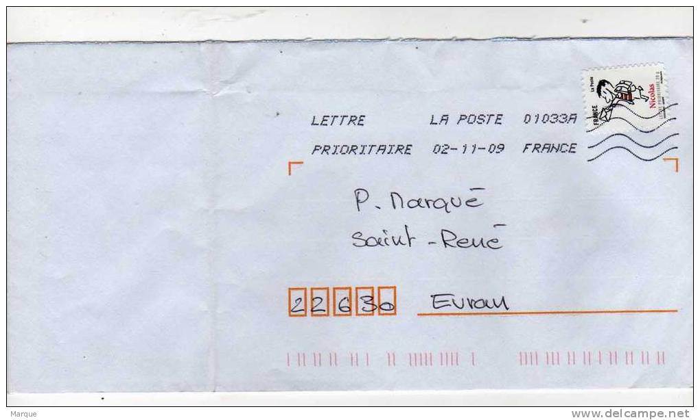

# Reconnaissance du code postal sur une enveloppe

Ceci est mon TIPE réalisé en 2017. Il s'agit d'un programme qui reconnait les codes postaux écrits sur les photos d'enveloppes comme la suivante :

Des réseaux de neurones déjà créés se trouvent dans le dossier [Networks](Networks)
Voici comment utiliser le code :
```
# To compile
make
# To launch the interface to create and train networks
make train
# To test networks on the envelope pictures
make test
# To generate the doc
male doc
```